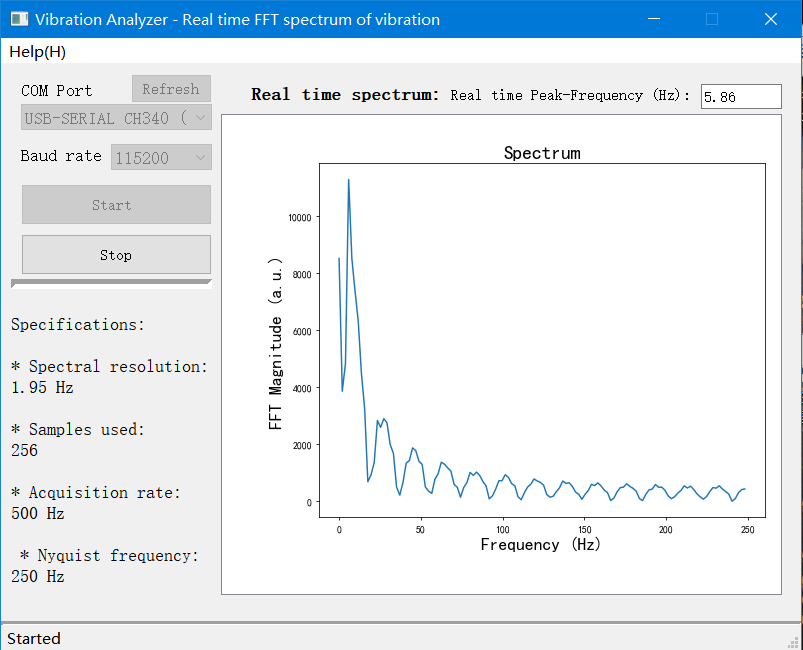

# Vibration-Analyzser based on FreeRTOS+STM32

Embedded Software Design with `FreeRTOS and STM32F103C8T6` (FFT Vibration Signal Processing) and PC Software Design with `Python` and PyQt

Screenshot of the host computer software:

## Specifications
* Spectral resolution: 1.95 Hz
* Samples used: 256
* Acquisition rate: 500 Hz
* Nyquist frequency: 250 Hz

## Description

This project aims to develop an embedded software solution using FreeRTOS and STM32F103C8T6 microcontroller for FFT (Fast Fourier Transform) vibration signal processing. Additionally, a PC software application is designed using Python and PyQt to serve as the user interface for displaying the results.

The embedded software component utilizes the FreeRTOS operating system to efficiently manage tasks and scheduling on the STM32F103C8T6 microcontroller. The FFT algorithm is implemented to process vibration signals acquired from sensors (MPU6050), enabling the analysis and interpretation of the signals' frequency content.

The magnitude of the FFT result of be transmitted to the host computer via serial communication.

On the PC side, a software application is developed using Python programming language and PyQt framework. This application provides a user-friendly interface. It allows users to visualize the processed data, monitor real-time sensor readings.

## Task scheduling using FreeRTOS
In this project, task scheduling is implemented using FreeRTOS to efficiently manage two tasks with the same priority.

The first task is responsible for sampling and conversion operations at a frequency of 500Hz. It acquires data and performs necessary calculations, storing the processed data into a circular buffer queue for further processing. This task ensures the availability of data for the FFT computation task.

The second task executes at a frequency of 4Hz and is responsible for performing the FFT calculation on the data acquired by the first task. It utilizes the input data from the circular buffer queue and applies the FFT algorithm to compute the magnitude of the signal. The computed magnitude is then transmitted to the PC software application for visualization.

To ensure proper synchronization and mutual exclusion when accessing shared resources, such as the circular buffer queue, a mutex is employed. 

## Features of the project

- Embedded software design with FreeRTOS and STM32F103C8T6 microcontroller.
- Implementation of the FFT algorithm for vibration signal processing.
- PC software design using Python and PyQt framework.
- User-friendly interface for system configuration and control.
- Real-time monitoring of sensor readings.
- Visualization of processed data.

## Hardware Connection

STM32f103c8t6:
* IIC1: OLED Screen (displays the real-time peak frequency)
* IIC2: MPU6050
* UART1: -> CH340 -> host computer

## Usage

Please follow the instructions below to set up and run the project:

1. Install the required dependencies for the embedded software and PC application.
2. Connect the hardware components as described in the hardware connection section.
3. Build and flash the embedded software onto the STM32F103C8T6 microcontroller.
4. Launch the PC software application and establish a connection with the embedded system.
5. Get the visualization in the user interface.

